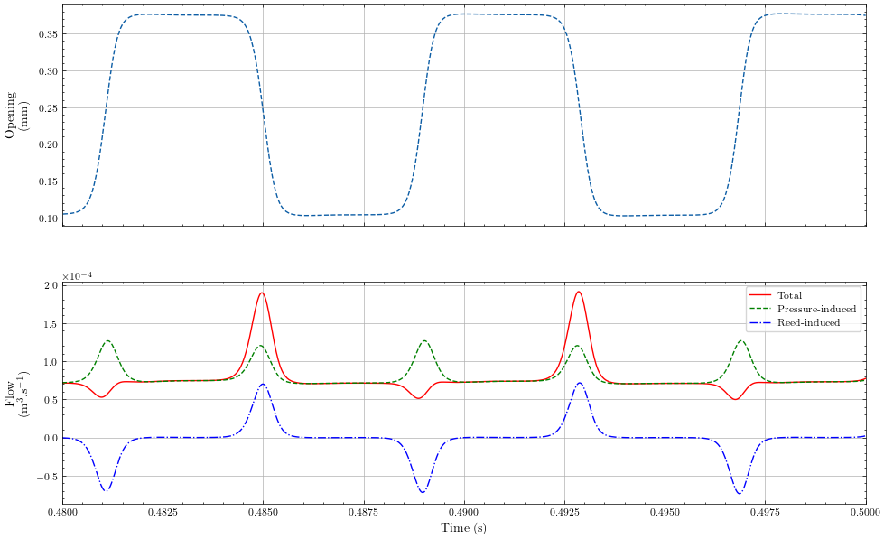
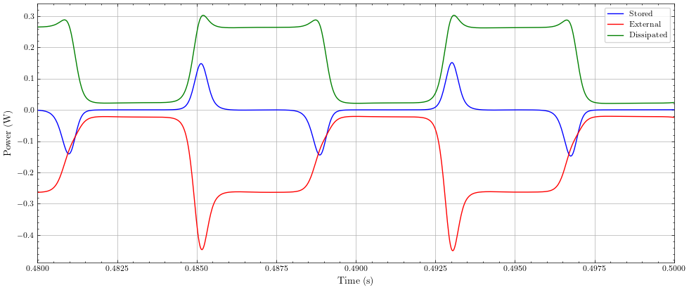
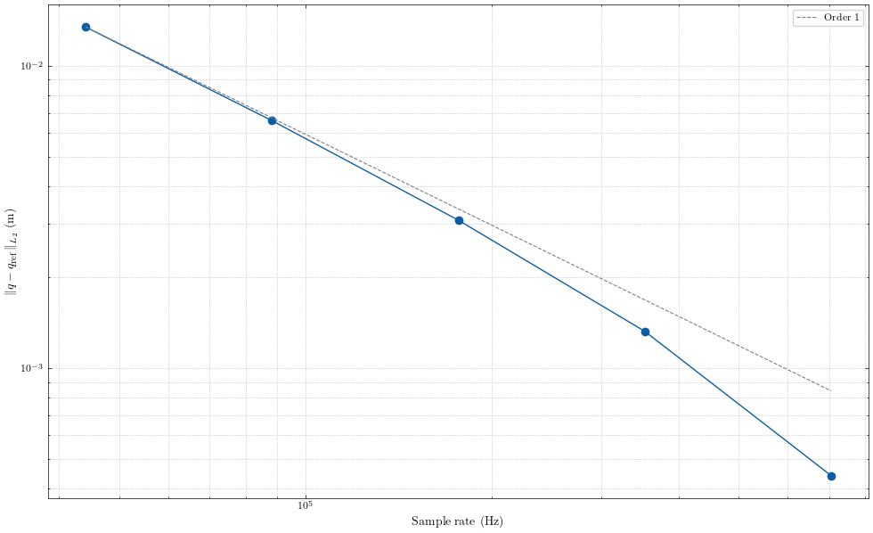
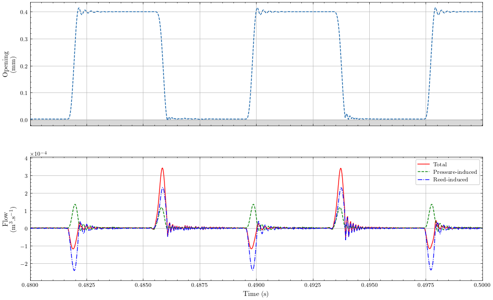
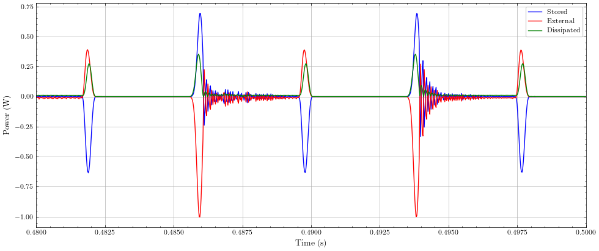
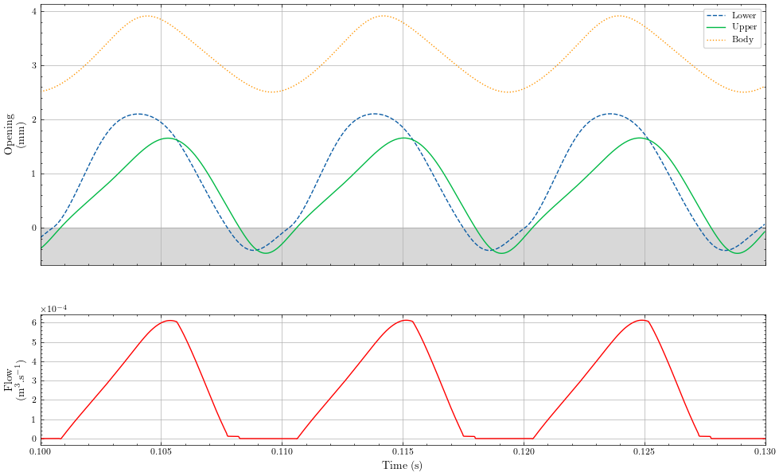
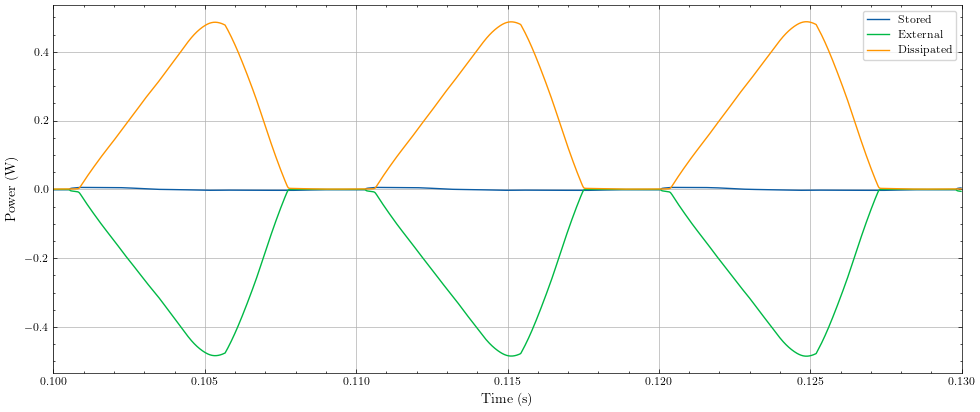
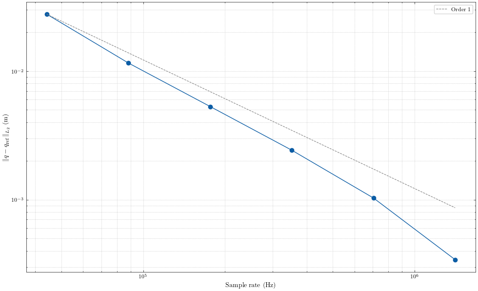

# Code for the paper "NON-ITERATIVE ENERGY BALANCED SCHEME FOR A CATEGORY OF SELF-OSCILLATING INSTRUMENTS" submitted to the Forum Acusticum 2026

The main goal of the paper is to propose a non-iterative method for the simulation of self-oscillating musical instruments including localized nonlinear dissipation laws (usually at the exciter position) and general conservative nonlinearities arising from non-quadratic potential energy.

This repo contains example code for the three simplified cases presented in the paper:
1. A bowed string. Here, the string model is considered linear for simplicity. A modal spatial discretization is used. This results in the need to solve a linear system at each time-step which is a rank 1 perturbation to a constant diagonal matrix, that can be solved using the Sherman-Morrison formula. A nonlinearity could be added to the string model itself, in which case a linear system with a rank 2 perturbation of a constant diagonal matrix would have to be solved at each time-step, using the Woodbury formula (need to compute the inverse of a $2\times 2$ matrix).
2. A single reed instrument. The exciter here is a scalar system such that solving the linear system is trivial. However, this case demonstrates the coupling with a resonator representing the bore of the instrument.
3. Voice, using the body-cover model of the vocal folds.

## Structure 
The repo contain two main folder `/python` containing the python code used to generate figures from the C++ code in `src`.

## Some simulation results

Examples of simulation results obtained using the provided C++ code and python scripts are given here for the three studied systems.

### Bowed string

The bowed string simulations are run for a linear string here. The string is discretized using a modal method.

### Single-reed instrument

The single reed instrument is composed of a mouthpiece flow model, connected to a single degree of freedom reed mechanical model and to an acoustic resonator (here a straight tube of circular section with $1$ cm radius and $66$ cm length, also including a first order radiation model).

A first simulation is made with the mouth pressure being set to $2000$ Pa (corresponding to a non-beating case). After the initial transient, the system settles to a periodic state. The following figure shows the opening (distance between the reed and the mouthpiece) and the flow going into the resonator as functions of time. The flow is also decomposed in two component: one induced by the pressure gradient and the other induced by the reed velocity.

The corresponding power balance, viewed from the mouthpiece components looks like:

The algorithm converges to a solution with the sampling frequency, at order 1 (error computed on the first $0.1$s of simulation).

If the mouth pressure is increased to $2500$ Pa, the reed is beating against the lay. SAV handles the contact potential. However, this case yields unsatisfying results (not converging) due to the original SAV method not handling correctly the stiff contact law (auxiliary variable drift). Modifications bases on sign constraint of the auxiliary variable (see [van Walstijn et al., 2024](https://www.sciencedirect.com/science/article/pii/S0022460X23004170)) should be used here but are not implemented in this code.

The power balance, viewed from the mouthpiece components looks like is nonetheless preserved:

### Voice

For the voice simulation, the body-cover model of the vocal folds is used. Using a configuration similar to configuration B of the original Story's paper, the following results are obtained:

The power balance is still conserved up to machine precision:

The scheme converges at first order:

For these simulations, the SAV control term from [Risse et al, 2025](https://dafx25.dii.univpm.it/wp-content/uploads/2025/09/DAFx25_paper_24.pdf) is used. Indeed, and contrary to what was initially expected, the nonlinearities in the vocal fold model (cubic laws on the springs + "light" contact laws) generate auxiliary variable drift, even when the contact stiffness is deactivated, and only the symmetric cubic term remains. 